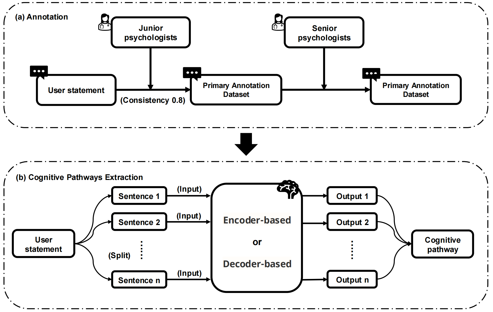
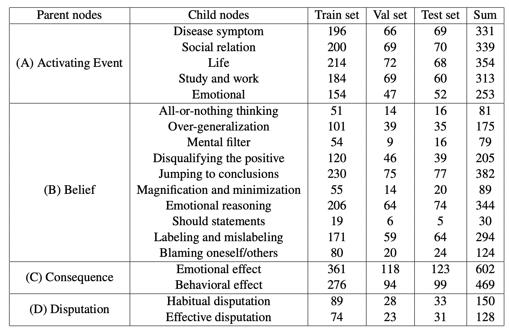
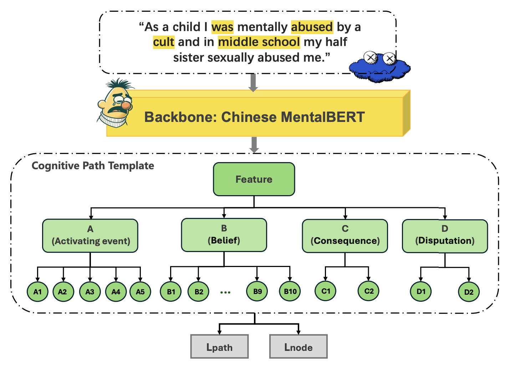

# Interpretable Tree-Structured Deep Learning Model for Extracting Cognitive Pathways from Social Media

This repository contains material associated to this [paper](#Citation).

It contains:
- link to the cognitive pathways extraction dataset we collected. ([link](#The-cognitive-pathways-extraction-dataset))
- link to code for performing three different strategies for hierarchical text classification on our dataset ([link](#Trained-nnU-net-models))

If you use this material, we would appreciate if you could cite the following reference.

## Citation
* Citation

## Model download
  Please download Chinese MentalBert from the following links, and put these checkpoints to `Hierarchical-Text-Classification/Hierarchical-Text-Classification/Chinese-MentalBERT` path.
* **Chinese-MentalBERT:** <https://huggingface.co/zwzzz/Chinese-MentalBERT>

## The cognitive pathways extraction dataset

The cognitive pathways extraction dataset we collected were source from three parts: comments from the ['ZouFan treehole'](https://www.weibo.com/xiaofan116?is_all=1) on Weibo, and posts from the 'SuicideWatch' and 'depression' subreddits on [Reddit](https://www.kaggle.com/datasets/nikhileswarkomati/suicide-watch). 
The data from the Reddit platform was translated into Chinese using Google Translate, and then manually checked by the annotator. In the subsequent data preprocessing process, we removed sentences containing non-ASCII characters and posts with less than 100 words. In the annotation of the subsequent dataset, 12 psychologists (including 10 junior psychologists and 2 senior psychologists) annotated 555 posts. In order to ensure the quality of the labels, the junior psychologists first performed primary data annotation with a consistency greater than 0.8, and then the senior psychologists formed the final advanced annotation dataset to form the final advanced annotation dataset. The annotation tool used was [the doccano platform](https://github.com/doccano/doccano). The annotation process can be seen in the following figure.

For the cognitive path extraction task, the dataset of 555 posts was split into training, validation, and test sets at a 6:2:2 ratio, comprising 333, 111, and 111 posts, respectively. At the sentence level, the 4742 sentences were distributed as 2835, 932, and 975 sentences across the training, validation, and test sets, respectively.
Note that the data split was performed at the post level to avoid data leakage.
The detailed data distribution is shown in the following table.

## Code for hierarchical text classification on our dataset
### Flat strategy
The flat strategy treats all labels as being on the same level, disregarding the hierarchical relationships between them. This method simplifies the problem to a traditional multi-class or multi-label classification task, where the model independently predicts the final labels without considering the parent-child relationships among them. 

### Ensemble strategy
The ensemble strategy involves training multiple models, each focusing on different parts or levels of the hierarchy.In our experiments, we trained deep learning models at the parent level, allowing each model to focus solely on predicting its sub-categories. The final predictions are derived by combining the outputs of all these models.

### Tree-Structured Model
Although large-scale pre-trained language models have been used in psychology, their black-box nature limits interpretability. We propose a tree-structured deep learning model to extract cognitive pathways for hierarchical classification. The proposed model was inspired by the original work of NBDT[1] in image data and the variant developed by Me-NDT[2] in the medical imaging domain.
Our model consists of a feature extraction module and a tree-structured classification module, where parent and child nodes are defined based on cognitive behavioral therapy principles.
Both the feature encoder and the decision path can be visualized for explanation or interpretation. The model architecture can be seen in following figure.

## References

1. Wan A, Dunlap L, Ho D, et al. NBDT: Neural-backed decision trees[J]. arXiv preprint arXiv:2004.00221, 2020.
2. Fu G, Wang R, Li J, et al. Me-NDT: Neural-backed Decision Tree for visual Explainability of deep Medical models[C]//Medical Imaging with Deep Learning 2021. 2021.
3. 
